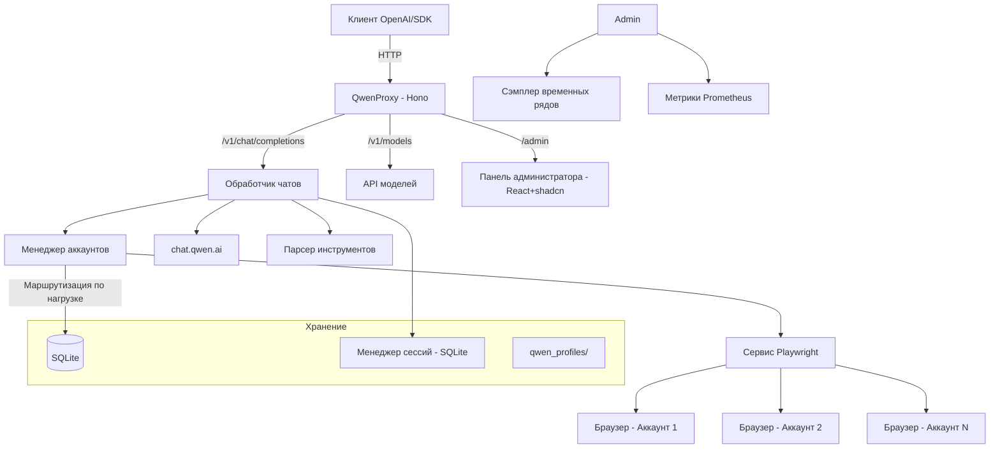

<p align="center">
  
</p>

Локальный Proxy API, совместимый с OpenAI, который маршрутизирует запросы к моделям **Qwen (chat.qwen.ai)** через автоматизацию браузера с помощью Playwright. Поддержка нескольких аккаунтов с **маршрутизацией по нагрузке (load-aware)**, **панелью администрирования** (React + shadcn/ui), **API-ключами для нескольких пользователей** с квотами, гибридными persistentными сессиями, выполнением инструментов, режимом рассуждений (reasoning) и хранением в SQLite.

[](https://github.com/pedrofariasx/qwenproxy/actions/workflows/ci.yml)
[](https://www.typescriptlang.org/)
[](https://hono.dev/)
[](https://playwright.dev/)
[](LICENSE)
<a href="https://www.buymeacoffee.com/pedrofariasx" target="_blank"></a>

---

## Возможности

- **Совместимость с API OpenAI** — Интерфейс совместим с `/v1/chat/completions`, `/v1/models` и `/v1/upload`.
- **Несколько аккаунтов** — Несколько аккаунтов Qwen с **маршрутизацией по нагрузке** (load-aware scheduling), автоматическим cooldown и пулом прогретых чатов.
- **Панель администрирования** — Полноценная панель управления в `/admin` (React + shadcn/ui) с графиками в реальном времени через SSE.
- **Несколько пользователей** — API-ключи для каждого пользователя с ограничением скорости (RPM) и потолком параллельности.
- **Гибридные сессии** — Persistentные сессии разговоров (SQLite) с экономной отправкой, проверкой истории и защитой от вырожденных ответов ("Yes").
- **Гостевой режим** — Режим гостя без необходимости входа, использующий публичный API Qwen.
- **Хранение в SQLite** — Аккаунты, пользователи и сессии в базе SQLite (режим WAL).
- **Поддержка рассуждений** — Полная поддержка режима рассуждений (thinking) моделей Qwen.
- **Мультимодальная загрузка** — Отправка изображений, видео, аудио и документов через `/v1/upload` с интеграцией в OSS Qwen (текст встраивается в промпт).
- **Выполнение инструментов** — Встроенная система выполнения локальных инструментов, интегрированная в поток чата.
- **Persistentные сессии** — Persistentный профиль браузера для каждого аккаунта в `qwen_profiles/`.
- **Авто-вход** — Автоматический вход по учётным данным с восстановлением сессии.
- **Выбор браузера** — Chromium, Chrome, Firefox, Edge или WebKit.
- **Мониторинг** — Health check, метрики Prometheus, watchdog и временные ряды (выборки каждые 5с, окно 20мин).
- **CLI бинарник** — Установите глобально через npm и используйте команду `qwenproxy` напрямую.
- **Готовность к Docker** — Деплой на VPS с Docker, persistentными томами и корректным завершением.

---

## Архитектура



---

## Предварительные требования

| Зависимость          | Минимальная версия | Установка                                        |
| -------------------- | ------------------ | ------------------------------------------------- |
| Node.js              | v20.x              | [nvm](https://github.com/nvm-sh/nvm)              |
| npm                  | v9.x               | Встроен в Node.js                                 |
| Playwright           | -                  | `npx playwright install`                          |
| Docker (опционально) | v24.x              | [Docker Docs](https://docs.docker.com/get-docker/) |

---

## Установка

### Через npm (глобально)

```bash
npm install -g @pedrofariasx/qwenproxy
npx playwright install
qwenproxy
```

### Через npm (локально)

```bash
git clone https://github.com/pedrofariasx/qwenproxy.git
cd qwenproxy
npm install
npx playwright install
```

### Через Docker

```bash
docker-compose up -d
```

---

## Конфигурация

Создайте файл `.env` в корне проекта (см. `.env.example`):

```env
# Порт сервера (по умолчанию: 3000)
PORT=3000

# Хост сервера (по умолчанию: 0.0.0.0)
HOST=0.0.0.0

# API-ключ для защиты эндпоинтов (опционально)
API_KEY=ваш-секретный-ключ-здесь

# Учётные данные Qwen для автоматического входа (режим одного аккаунта)
QWEN_EMAIL=ваш-email@пример.com
QWEN_PASSWORD=ваш-пароль-здесь

# Гостевой режим - без входа, использует публичный API (по умолчанию: false)
QWEN_GUEST_MODE_ONLY=false

# Браузер (chromium, firefox, chrome, edge, webkit)
BROWSER=chromium

# Запускать браузер без графического интерфейса (по умолчанию: true)
HEADLESS=true

# Таймауты (в миллисекундах)
NAVIGATION_TIMEOUT=90000
PAGE_TIMEOUT=60000
HTTP_TIMEOUT=45000
HEADERS_TIMEOUT=90000
CHAT_TIMEOUT=120000
STREAM_IDLE_TIMEOUT=180000
```

---

## Управление аккаунтами

Аккаунты хранятся в SQLite (`data/qwenproxy.db`). Используйте интерактивный CLI для управления:

```bash
# Открыть менеджер аккаунтов
npm run login

# С указанием конкретного браузера
npm run login:firefox
npm run login:chrome
npm run login:edge
```

Интерактивное меню позволяет:

- **[A]** Добавить аккаунт с учётными данными (email + пароль)
- **[M]** Добавить аккаунт через ручной вход в браузере
- **[R]** Удалить аккаунт
- **[L]** Войти во все аккаунты (инициализировать сессии)

> При первом запуске, если существует старый `accounts.json`, аккаунты будут автоматически мигрированы в SQLite.

---

## Использование

### Запуск сервера

```bash
npm start                  # Chromium (по умолчанию)
npm run start:chrome       # Google Chrome
npm run start:firefox      # Firefox
npm run start:edge         # Microsoft Edge
```

Сервер запускается на `http://localhost:3000` со следующими маршрутами:

| Маршрут                    | Метод | Описание                                                              |
| -------------------------- | ------ | --------------------------------------------------------------------- |
| `/v1/chat/completions`     | POST   | Генерация ответов (стриминг и без стриминга)                         |
| `/v1/chat/completions/stop`| POST   | Прервать активную генерацию                                           |
| `/v1/models`               | GET    | Список доступных моделей                                              |
| `/v1/models/:model`        | GET    | Информация о конкретной модели                                       |
| `/v1/upload`               | POST   | Загрузка мультимодальных файлов (изображения, видео, аудио, документы)|
| `/admin`                   | GET    | Панель администрирования (React + shadcn/ui)                          |
| `/health`                  | GET    | Health check с состоянием системы                                     |
| `/metrics`                 | GET    | Метрики в формате Prometheus                                          |

---

## Примеры интеграции

### OpenAI SDK (Node.js)

```typescript
import OpenAI from "openai";

const openai = new OpenAI({
  baseURL: "http://localhost:3000/v1",
  apiKey: process.env.API_KEY || "sk-no-key-required",
});

const completion = await openai.chat.completions.create({
  model: "qwen-plus",
  messages: [{ role: "user", content: "Объясни как работает Playwright." }],
});

console.log(completion.choices[0].message.content);
```

### cURL

```bash
curl http://localhost:3000/v1/chat/completions \
  -H "Content-Type: application/json" \
  -H "Authorization: Bearer ваш-ключ" \
  -d '{
    "model": "qwen-plus",
    "messages": [{"role": "user", "content": "Привет!"}],
    "stream": true
  }'
```

## Гибридные сессии (экономия контекста) и загрузка файлов .txt

Для длинных разговоров прокси использует **гибридную структуру**: первое сообщение разговора отправляет полную историю (bootstrap); далее отправляются только `system` + последнее сообщение пользователя, используя историю, которую Qwen хранит на стороне сервера для того же `chat_id` (с threading через `parent_id`).

Для активации укажите тот же ключ сессии во всех сообщениях разговора, используя поле OpenAI `user` (или заголовок `x-qwen-session`):

```typescript
const completion = await openai.chat.completions.create({
  model: "qwen-plus",
  user: "мой-разговор-123",
  messages: [
    /* полная история разговора */
  ],
});

// Ответ содержит `session_id` (chat_id в Qwen). Вы можете продолжить
// разговор, передав это значение обратно в поле `user`.
console.log(completion.session_id);
```

- **Ход 1** сессии: `parent_id = null`, отправляется полная история.
- **Последующие ходы**: только `User: <последнее сообщение>` с `parent_id`, указывающим на последний ответ, что значительно снижает количество отправляемых токенов.
- Без ключа сессии прокси сохраняет оригинальное поведение (отправляет полную историю, но по-прежнему связывает сообщения через `parent_id`).
- Когда разговор включает `tools` или мультимодальный контент, экономный режим автоматически отключается и полная история всегда отправляется.

**Текстовые файлы (.txt/.md/.csv/...)**, отправленные пользователем, или большие промпты **встраиваются в текст сообщения** (чтобы модель всегда видела содержимое) с явной директивой полного ответа. Вырожденные ответы (только "Yes", "Ok", "Да") обнаруживаются, и в нестриминговом режиме запрос повторяется с корректирующей директивой — они никогда не передаются как окончательный ответ.

Конфигурация (`.env`):

```
HYBRID_SESSIONS_ENABLED=true
HYBRID_SESSION_VERIFY=true   # проверяет историю на сервере перед повторным использованием; расхождение → повторный bootstrap
HYBRID_SESSION_TTL_MS=86400000
```

## Панель администрирования

Перейдите на `http://localhost:3000/admin` для управления проектом на одном экране — фронтенд **React 19 + shadcn/ui** (папка `web/`, Vite + Tailwind v4), раздаётся напрямую прокси.

Что доступно:

- **Обзор** — KPI (запросы, ошибки, латентность, стримы, сессии и **RSS% памяти** системы) + **графики в реальном времени** по типам данных: запросы/мин и ошибки в **столбцах**, латентность в **линии**, стримы/память/сессии в **области**. Данные приходят через **Server-Sent Events** (одно соединение, push каждые 3с), с выборками по 5с и окном 20мин; при обрыве потока автоматический fallback на polling каждые 4с.
- **Аккаунты** — добавление/удаление аккаунтов Qwen, очистка cooldown, принудительное обновление заголовков и просмотр текущей нагрузки каждого аккаунта (прогресс-бары).
- **API-ключи** — мультипользовательский: создание/редактирование/удаление пользователей, регенерация ключей и настройка **RPM** и **параллельности** для каждого пользователя.
- **Конфигурация** — редактирование основных переменных `.env` (с валидацией и списком допустимых значений), скачивание метрик в Prometheus и перезапуск сервера.
- **Метрики** — полный вывод Prometheus из `/metrics`, сгруппированный по метрикам, с поиском и кнопкой копирования.

<p align="center">
  
</p>

**Сборка фронтенда** (необходима, если папка `web/dist` не существует; сервер использует простую встроенную панель как fallback):

```bash
npm --prefix web install
npm --prefix web run build   # или из корня: npm run build:admin
```

Аутентификация: задайте `ADMIN_PASSWORD` в `.env` (или оставьте пустым для использования `API_KEY`). Сессия использует подписанный HttpOnly cookie (7 дней).

```
ADMIN_PASSWORD=
```

---

## Мультипользовательский режим (API-ключи с квотами)

При доступе для нескольких пользователей каждый получает свой API-ключ с **ограничением скорости** (запросы в минуту) и **потолком параллельности** (одновременные стримы). Ключи хранятся в таблице `users` SQLite и могут быть созданы через панель `/admin` или через `USER_API_KEYS` в `.env`:

```env
USER_RATE_LIMIT_RPM=120        # по умолчанию для пользователя
USER_MAX_CONCURRENCY=8         # максимум одновременных стримов на пользователя
USER_API_KEYS=sk-key-1:пользователь1,sk-key-2:пользователь2
```

Клиенты аутентифицируются через `Authorization: Bearer <ключ>`. Глобальная `API_KEY` продолжает работать как пользователь `global` (без ограничений квоты). Пользователь, превысивший лимит, получает `429` с соответствующим сообщением.

---

## Деплой в 1 клик

> ⚠️ Прокси требует **браузер (Docker)** и **persistentное хранилище** (SQLite сессий + профили аккаунтов). Не работает в serverless (Vercel/Netlify/Cloud Run без контейнера).

| Провайдер | Кнопка | Примечания |
| --- | --- | --- |
| **Render** (рекомендуется) | [](https://render.com/deploy?repo=https://github.com/pedrofariasx/qwenproxy) | Docker + persistentный диск (1GB) настраиваются через `render.yaml`. Бесплатный план с sleep — разбудите через healthcheck. |
| **Railway** | [](https://railway.app/new?template=https://github.com/pedrofariasx/qwenproxy) | Автоматически определяет `Dockerfile`. **Создайте том** и смонтируйте в `/app/data` (профили в `USER_DATA_DIR=/app/data/qwen_profiles`), чтобы не потерять сессии. |

### Общие шаги после деплоя

1. Откройте `/admin` (аутентификация через `ADMIN_PASSWORD` или `API_KEY`).
2. Добавьте аккаунты Qwen на вкладке **Аккаунты** (или задайте `SINGLE_ACCOUNT_MODE` + `SINGLE_ACCOUNT_ID/EMAIL` на панели).
3. Задайте чувствительные переменные окружения на панели провайдера: `API_KEY`, `ADMIN_PASSWORD`, `QWEN_EMAIL`, `QWEN_PASSWORD`.

---

## Деплой через Docker

### docker-compose.yml

```yaml
services:
  qwenproxy:
    build: .
    container_name: qwenproxy
    ports:
      - "${PORT:-3000}:${PORT:-3000}"
    env_file:
      - path: .env
        required: false
    volumes:
      - qwenproxy_data:/app/data
      - qwenproxy_profiles:/app/qwen_profiles
    restart: unless-stopped
    shm_size: '1gb'
    logging:
      driver: "json-file"
      options:
        max-size: "10m"
        max-file: "3"

volumes:
  qwenproxy_data:
  qwenproxy_profiles:
```

### Persistentные тома

| Том                  | Содержимое                                                            |
| -------------------- | --------------------------------------------------------------------- |
| `qwenproxy_data`     | База SQLite: аккаунты, пользователи (API-ключи) и сессии (`qwenproxy.db`) |
| `qwenproxy_profiles` | Профили браузеров для каждого аккаунта (cookies, сессии)              |

Контейнер автоматически настраивает права доступа к этим томам при запуске. Если используете bind mounts вместо именованных томов выше, убедитесь, что смонтированные директории доступны для записи контейнером.

---

## Структура проекта

```
qwenproxy/
├── bin/
│   └── qwenproxy.mjs            # Точка входа CLI бинарника
├── src/
│   ├── index.ts                 # Точка входа сервера
│   ├── login.ts                 # CLI управления аккаунтами
│   ├── api/
│   │   ├── admin.ts             # Бэкенд панели администратора (+ SSE /api/live)
│   │   ├── admin-dashboard.ts   # Встроенный fallback dashboard (HTML)
│   │   ├── models.ts            # Эндпоинты /v1/models
│   │   └── server.ts            # Сервер Hono + запуск + аутентификация
│   ├── cache/
│   │   └── memory-cache.ts      # Кэш в памяти с TTL
│   ├── core/
│   │   ├── account-manager.ts   # Маршрутизация load-aware + cooldowns + draining
│   │   ├── account-lanes.ts     # Линии аккаунтов (режим одного аккаунта)
│   │   ├── accounts.ts          # CRUD аккаунтов (SQLite)
│   │   ├── config.ts            # Конфигурация с Zod
│   │   ├── crypto-utils.ts      # Шифрование паролей в покое
│   │   ├── database.ts          # Подключение, миграции (аккаунты/пользователи/сессии)
│   │   ├── env-settings.ts      # Безопасное чтение/запись .env (админ)
│   │   ├── logger.ts            # Структурированный логгер
│   │   ├── metrics.ts           # Сбор метрик Prometheus (память RSS)
│   │   ├── model-registry.ts    # Реестр моделей и контекстных окон
│   │   ├── stream-registry.ts   # Трекинг активных стримов
│   │   ├── time-series.ts       # Сэмплер временных рядов (графики)
│   │   ├── user-manager.ts      # Мультипользовательская идентификация + квоты
│   │   └── watchdog.ts          # Мониторинг состояния (RAM через RSS)
│   ├── routes/
│   │   ├── chat.ts              # Обработчик /v1/chat/completions
│   │   ├── sse-parser.ts        # Инкрементальный парсер SSE + delta
│   │   ├── stream-handler.ts    # Стриминг SSE + защита от вырожденных ответов
│   │   ├── tool-handler.ts      # Выполнение локальных инструментов
│   │   └── upload.ts            # Загрузка мультимодальных + текстовых документов
│   ├── services/
│   │   ├── browser-manager.ts   # Жизненный цикл браузеров/контекстов
│   │   ├── error-handler.ts     # Типизация и повтор попыток ошибок Qwen
│   │   ├── header-interceptor.ts # Захват cookies/заголовков через CDP
│   │   ├── playwright.ts        # Фасад сервиса Playwright
│   │   ├── qwen.ts              # Интеграция с API Qwen
│   │   ├── session-manager.ts   # Persistentные гибридные сессии (SQLite)
│   │   ├── stealth.ts           # Скрипт анти-обнаружения
│   │   ├── stream-bridge.ts     # Мост потока браузер → Node
│   │   ├── stream-creator.ts    # Создание чатов и потоков Qwen
│   │   └── warm-pool.ts         # Пул прогретых чатов
│   ├── tests/                   # Автоматизированные тесты (node:test)
│   ├── tools/
│   │   ├── parser.ts            # Парсер тегов <tool_call>
│   │   ├── registry.ts          # Реестр инструментов
│   │   ├── schema.ts            # Валидация JSON Schema
│   │   └── types.ts             # Типы системы инструментов
│   └── utils/
│       ├── context-truncation.ts # Усечение контекста
│       ├── degenerate-answer.ts  # Обнаружение вырожденных ответов ("Yes")
│       ├── json.ts              # Надёжный парсер JSON
│       ├── qwen-stream-parser.ts # Парсер потоков SSE от Qwen
│       └── types.ts             # Реэкспорт типов
├── web/                         # Панель администратора (React + shadcn/ui)
│   ├── src/
│   │   ├── App.tsx              # Оболочка (боковая панель, навигация, вход)
│   │   ├── components/          # UI (shadcn) + графики (recharts)
│   │   ├── hooks/use-live.ts    # SSE клиент с fallback на polling
│   │   ├── pages/               # Обзор, Аккаунты, API-ключи, Конфигурация, Метрики
│   │   └── lib/                 # Клиент API администратора
│   ├── public/                  # Логотип и favicon
│   ├── index.html
│   └── package.json
├── data/                        # База SQLite (игнорируется git)
├── qwen_profiles/               # Профили браузеров для аккаунтов (игнорируется git)
├── Dockerfile
├── docker-compose.yml
├── tsconfig.json
├── tsconfig.build.json
└── package.json
```

---

## Решение проблем

| Проблема                         | Решение                                                       |
| -------------------------------- | ------------------------------------------------------------- |
| Порт занят                       | Измените `PORT` в `.env` или завершите процесс на порту 3000  |
| Браузер не открывается           | Выполните `npx playwright install`                            |
| Сессия истекла                   | Выполните `npm run login` для обновления cookies              |
| Rate limit на всех аккаунтах     | Добавьте больше аккаунтов через `npm run login`               |
| База повреждена                  | Удалите `data/qwenproxy.db` и заново добавьте аккаунты        |
| Dashboard показывает fallback    | Запустите `npm run build:admin` для сборки UI React           |

---

## Отказ от ответственности

> Этот проект предоставляется строго в образовательных и исследовательских целях.

Авторы не поощряют и не одобряют:

- Нарушение Условий использования платформы Qwen.
- Несанкционированную автоматизацию в промышленных масштабах.
- Использование в злонамеренных целях.

**Используйте на свой страх и риск.**
